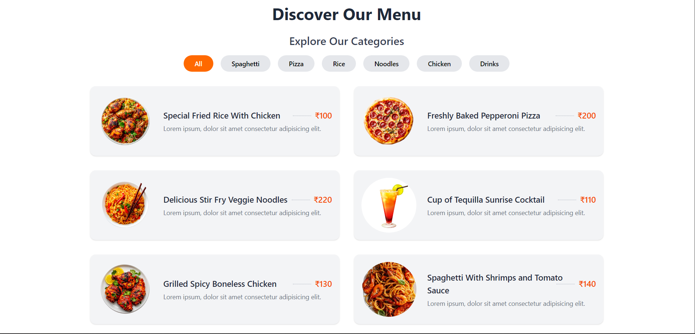
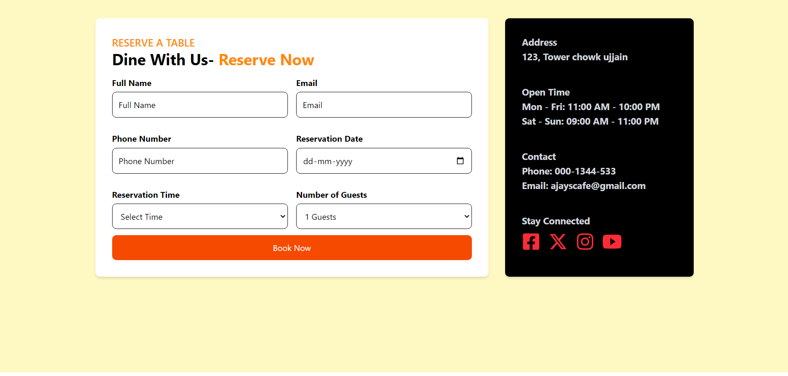
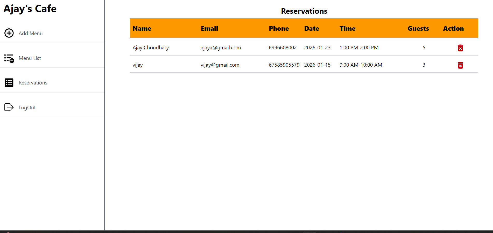

# 🍽️ Restaurant Table Reservation System

A full-stack *Restaurant Table Reservation System* built using *React, **MongoDB, **Node.js, and **Express*.  
The system allows customers to view the menu and reserve tables, while admins can manage menu items and handle reservations through an admin panel.

---

## 🚀 Features

### 👤 User Features
- View restaurant menu
- Reserve a table by selecting date, time, and number of guests
- Simple and responsive user interface
- Real-time reservation status

### 🛠️ Admin Features
- Secure admin panel
- Add, update, and delete menu items
- View and manage table reservations
- Accept or reject reservations
- Dashboard for reservation management

---

## 🧑‍💻 Tech Stack

### Frontend
- React
- React Router
- CSS / Tailwind (optional)
- Axios

### Backend
- Node.js
- Express.js
- MongoDB
- Mongoose
- JWT Authentication

### Database
- MongoDB (Atlas / Local)

---

## 📋 Functional Modules

### 1️⃣ Menu Management
- Display food items with price and description
- Admin can create, update, or delete menu items

### 2️⃣ Table Reservation
- Users can book tables online
- Stores reservation details in MongoDB
- Admin can manage reservations

### 3️⃣ Admin Panel
- Secure login
- Reservation handling
- Menu control

## 📸 Screenshots

### 🏠 Home Page


### 🍽️ Menu Page


### 📅 Table Reservation


### 🛠️ Admin table Management


---

## ⚙️ Installation & Setup

### Clone the repository
```bash
git clone https://github.com/username/restaurant-reservation-system.git
cd restaurant-reservation-system
